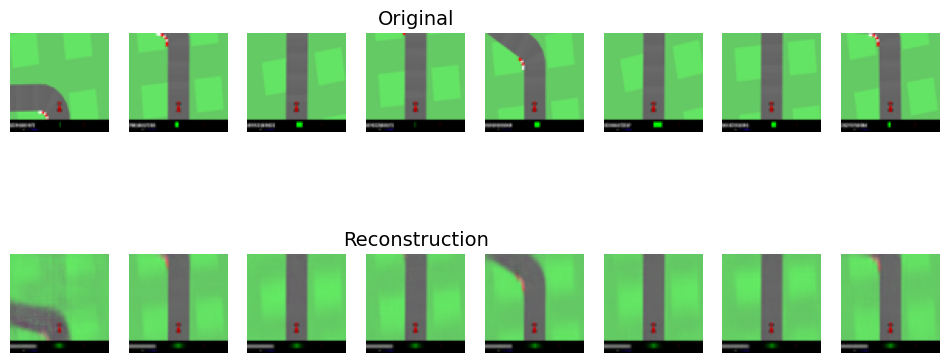
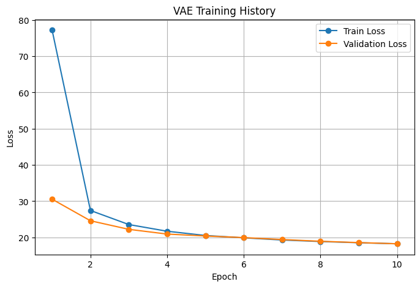

# Learning Compact Predictive World Models for Visual Control

A visual world-modeling project for the CarRacing environment focused on learning compact representations, predicting future latent states, and making those predictions easier to visualize and interpret.

The project follows this pipeline:

**pixels → VAE → MDN-RNN → controller**

## Project goal

The goal is to study how an agent can compress visual observations into a compact latent representation, learn how that latent state changes over time under different actions, and use those predictions for sequential decision-making.

A key focus is interpretability: predicted latent states can be decoded back into images and compared with actual future observations, making it possible to inspect where the model predicts well and where errors accumulate.

## Current progress

- [x] Collect CarRacing trajectories
- [x] Train/validation dataset pipeline
- [x] Convolutional VAE
- [x] VAE checkpointing and reconstruction evaluation
- [ ] MDN-RNN latent dynamics model
- [ ] Controller
- [ ] Multi-step latent rollouts and evaluation

## VAE results

The VAE compresses each **64×64 RGB frame** into a **32-dimensional latent vector** and reconstructs the observation from that representation.

### Reconstructions

### Training history

## Repository

- `collect.py` — collect CarRacing episodes
- `dataset.py` — training/validation data loading
- `vae.py` — convolutional VAE
- `train_vae.py` — VAE training and checkpointing
- `vizualize_vae.py` — reconstruction visualization
- `VAE_final.ipynb` — end-to-end VAE notebook
- `PROGRESS.md` — daily build log

## Research direction

The next stage is to learn action-conditioned latent dynamics with an MDN-RNN, then evaluate how accurately predicted latent states can be rolled forward and decoded into visual future observations.

This project is inspired by the World Models framework introduced by Ha and Schmidhuber and uses it as a foundation for exploring compact predictive models, latent dynamics, and visual interpretability in control.

## Keywords

World models, variational autoencoder (VAE), mixture density network recurrent neural network (MDN-RNN), explainable AI, latent dynamics, representation learning, visual control.
